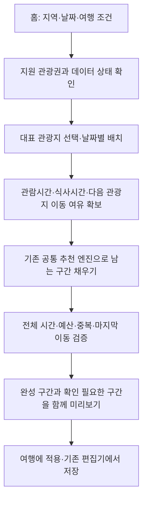

# 노플랜 PC 관광지·주변 코스 통합 개발 로드맵

작성: 2026-09-18 · 마감: **2026-09-21 월요일 16:00 KST 이전**

> **9월 18일 후속 결정으로 수정:** 사용자는 지방 가게 사전 수집을 공모전 준비의 필수 조건에서 제외했다. 현재 위치 반경에 승인 DB 장소가 있으면 기존 DB를 사용하고, 없으면 카카오 API의 실시간 후보를 공통 추천 엔진에 전달한다. 가격 미확인 후보도 허용하되 총예산은 미검증으로 표시한다. 아래 지방 사전 수집 일정·출시 조건은 최초 제안의 기록이며, 최신 구현과 변경된 일정은 [실시간 장소 보완 구현 기록](noplan-live-place-fallback-2026-09-18.md)을 우선 참고한다.

이 문서는 사용자가 요청한 개발 로드맵이다. 이 문서 작성으로 기능 개발, 데이터 수집, 운영 DB 변경 또는 배포가 완료된 것은 아니다. 아래 수량·일정은 제안이며 공급자 승인, 수집 결과, 실제 작업 가능 시간에 따라 축소한다. 주말을 포함한 약 3일의 달력상 기간을 72시간의 개발 공수로 계산하지 않는다.

## 1. 목표와 첫 출시 범위

PC 홈에서 여행 지역·기간을 입력하면 대표 관광지를 날짜별 오전·오후·저녁에 배치하고, 각 관광지 주변의 식사·카페·놀거리를 기존 모바일 추천 엔진으로 채운다. 최종 결과는 하나의 편집·저장 가능한 여행이다.

첫 시범 지역은 **울산·경주**다. 전국 확대는 같은 구조로 이어갈 장기 목표로 둔다. 월요일까지 전국 가게 수집·품질검증·모든 교통수단의 경로 최적화를 완료한다고 약속하지 않는다.

| 범위 | 월요일까지의 제안 |
|---|---|
| 관광지 자료 | 울산·경주 대표 관광지 우선 수집·검수. 전국 기본 목록 수집은 여유가 있을 때만 진행 |
| 소주제 자동 추천 | 검증된 가게가 확보된 관광권의 도보 구간부터 제공 |
| 여행 기간 | 두 지역 각각 당일 일정의 전체 흐름을 필수 검증. 1박 2일은 일요일 기능 동결 전 검증 성공 시 공개 |
| 기존 1~14일 편집 | 기존 기능 유지. 자동 생성 지원 기간과 수동 편집 가능 기간을 구분 |
| 교통 | 검증 가능한 도보 구간 우선. 차량·대중교통 및 관광권 사이 이동은 직접 설정한 이동시간 또는 확인 필요 상태로 처리 |
| 부분 실패 | 완성된 관광지·추천 구간은 유지하고 실패한 구간만 다시 생성 가능 |
| 계정 저장 | 기존 명시적 저장, 소유자 인증, 버전 충돌 보호 유지 |

전국 관광지를 검색할 수 있는 것, 전국 여행 초안을 작성할 수 있는 것, 전국의 검증 가게로 자동 코스를 만들 수 있는 것은 서로 다른 지원 범위다. 화면에서도 이를 구분한다. 정식 한국관광 100선 선정 항목만 해당 배지를 붙이고, 그 외 관광공사 등록 관광지는 출처만 표시한다.

## 2. 지방 가게 부족에 대한 권장 전략

**관광지는 공공데이터로 확보하고, 가게는 선택한 관광권 주변에 집중 수집한다.** 기존 서울 추천 품질 기준을 지방에서 조용히 낮추지 않는다.

| 대안 | 장점 | 문제 | 이번 선택 |
|---|---|---|---|
| 전국을 Apify로 수집 | 지역 확장성 | 수집·메뉴 연결·검수·비용을 마감 안에 통제하기 어려움 | 출시 이후 |
| 관광권 단위로 Apify 수집 | 적은 데이터로 실제 여행 구간을 검증 가능 | 지원 지역이 제한됨 | 주력 |
| TourAPI 음식점 정보 활용 | 공공기관 출처의 장소 후보 확보 | 노플랜 별점·리뷰·메뉴 검증과 다른 근거 | 후보 탐색·직접 선택 보조 |
| 카카오 Local 주변 검색 | 좌표 기반 후보 발견에 적합 | 응답에 별점·리뷰 수·메뉴 가격 없음 | 후보 발견용 |
| 여행 생성 시 즉석 크롤링 | 미수집 지역 대응 가능성 | 사용자 대기·실패·비용·외부 장애가 여행 생성에 직결 | 이번 범위 제외 |

카카오 Local 공식 응답은 이름·주소·좌표·업종·장소 링크 등을 제공한다. 별점·리뷰·메뉴 검증은 별도 단계다. [공식 명세](https://developers.kakao.com/docs/ko/local/dev-guide)

TourAPI는 관광정보·사진·상세정보·동기화 목록을 제공한다. 개발계정 트래픽과 운영계정 승인을 확인하고 기존 행사 호출량까지 합산한다. [공식 API 안내](https://www.data.go.kr/data/15101578/openapi.do)

### 시범 관광권

| 지역 | 우선 검토 관광권 | 수집 방향 |
|---|---|---|
| 경주 | 대릉원·황리단길·첨성대·동궁과 월지 일대 | 가까운 관광지와 주변 상권을 묶어 첫 통합 일정 검증 |
| 울산 | 태화강 국가정원과 주변 먹거리단지 | 관람과 식사·카페가 연결되는 구간 우선 |
| 울산 추가 | 대왕암공원·일산해수욕장 일대 | 첫 관광권 성공 후 추가. 태화강 권역과의 이동은 별도 검증 |

위는 수집 시작점 제안이며 실제 도보 연결·운영시간·후보 수가 확인된 지원 범위가 아니다. 불국사 등 떨어진 명소도 관광지 목록에는 담을 수 있지만, 검증 없이 시내 도보 일정에 연결하지 않는다.

근거: [경주시 시내권 안내](https://gyeongju.go.kr/tour/page.do?mnu_uid=2528), [울산 태화강 먹거리단지](https://tour.ulsan.go.kr/tour/korean/contents.ulsan?mId=001002001004002000), [울산 대왕암공원](https://tour.ulsan.go.kr/tour/kor/unit/attrctn/view.ulsan?mId=001002001000000000&unqId=27).

### 수집량과 중단 기준

- 각 도시의 대표 관광지 5~8곳을 초기 검수 목표로 한다. 전부 한 일정에 넣는다는 뜻은 아니다.
- 첫 2개 관광권에서 각각 가게 후보 20~30곳부터 수집한다. 두 권역이 통과하면 세 번째 권역을 추가한다. 후보 수와 승인 수는 별도로 집계한다.
- 권역별 승인 식사 6곳·카페 4곳을 준비 목표로 제안한다. 이는 리뷰 기준이나 추천 성공 보장이 아니다. 날짜·운영시간·예산·취향을 반영한 실제 생성 성공 여부로 출시를 결정한다.
- 술집·놀거리는 후보가 확보된 범위에서만 제공한다. 식사·카페·관광만으로도 통합 흐름을 먼저 완성한다.
- 일요일 오전까지 데이터가 부족하면 수집 지역을 더 늘리지 않는다. 확보된 구간만 추천 가능 상태로 공개하고 나머지는 직접 선택으로 연결한다.
- 수집 실행 전에 현재 Apify 잔액·실제 Actor 비용·승인된 지출 상한을 확인한다. 이번 로드맵 작성은 유료 수집 실행을 포함하지 않는다.
- 소량 시험 수집으로 성공 1건당 비용·시간·승인율을 측정한다. 잔여 수집 가능량은 승인된 잔여 예산과 측정 비용으로 계산하고, 재시도·최대 실행 수·시간 상한을 둔다.
- 이름만으로 매칭하지 않는다. 공급자 ID, 주소, 좌표, 전화번호로 지점을 대조하고 중복 후보의 메뉴를 잘못 합치지 않는다.

## 3. 현재 코드에서 확인한 장애물

기준 프론트 HEAD `bad0fbb`, 백엔드 HEAD `74828f9`. 운영 DB·서비스키·운영 배포 상태는 이 문서 작성 중 확인하지 않았다.

| 현재 상태 | 필요한 변경 |
|---|---|
| `TripHome.tsx`는 빈 오전·오후·저녁 구간을 생성 | 생성 전 조건 확인과 통합 계획 실행 연결 |
| `TripRecommendations.tsx`는 서울 지명 정규식 + 도보로 활성화 | 서버가 알려주는 관광권별 지원 상태 사용 |
| `courseLocation.js`의 카탈로그 지역은 서울·홍대·성수 | 좌표 기반 관광권 설정 추가. 이름만으로 서울로 폴백하지 않기 |
| `generate.js`의 승인 장소 SQL은 `seoul_*`, `hongdae`, `seongsu`만 조회 | 지원 관광권·좌표 범위로 조회하고 서울 회귀 검증 |
| 일부 수집 유틸리티는 알 수 없는 지역을 홍대로 정규화 | 지방 수집 전에 해당 경로 제거 또는 명시적 거절 |
| `toTripPlace`와 서버 저장 검증이 기본 장소 속성만 보존 | 관광지 기준점, 역할, 방문 시각, 비용·경로 근거를 왕복 저장 |
| 기존 구간 추천은 출발점 주변을 채우고 다음 구간 도착을 보장하지 않음 | 다음 고정 관광지까지의 마지막 이동 구간 검증 |
| 예산은 현재 추가 구간의 1인 예산 | 여행·하루·구간 예산을 명확하게 구분하고 누적 계산 |
| 여행 구간은 같은 날짜의 종료 > 시작 조건 | 1차 PC 자동 생성은 자정 전 종료. 모바일의 익일 종료 지원은 유지 |

### ‘검증 가게’의 실제 기준을 먼저 확정

코드의 일반 품질검사는 기본 별점 3.5·리뷰 10을 사용하지만, 일부 수집 경로에는 다른 최소 리뷰 수와 B/C 완화 등급이 있다. 자동 승인에는 네이버 장소 매칭과 음식·카페·술집의 메뉴 매칭 조건도 있다.

또한 `collectSeoulDongGridCatalog.js`의 `mergeNaverQuality`는 네이버 평점이 있으면 우선 사용하고, 통합 리뷰 수에 두 공급자의 최대값을 넣는다. 따라서 현재 데이터 전체가 ‘카카오 별점 3.5 이상 AND 네이버 리뷰 N개 이상’을 통과했다고 코드만으로 단정할 수 없다.

첫 단계에서 적용 중인 수집 경로와 저장 원본을 확인해 정확한 정책을 명시한다. 지방 신규 수집에는 카카오 평점, 카카오 리뷰 수, 네이버 방문자 리뷰 수, 네이버 기타 리뷰 수를 별도 근거로 보존하고 정책 버전을 기록한다. 사용자에게 제시할 최소 리뷰 수가 미확정이면 임의로 인증 배지를 붙이지 않는다. 서울 기존 데이터를 이번 출시 때문에 일괄 재분류하지 않는다.

## 4. 통합 계획의 최소 구현 방식

새 PC 전용 추천 엔진을 복제하지 않는다. 서버에 관광지 배치·시간 배분·구간 연결을 맡는 조정 로직을 추가하고, 기존 추천 엔진을 공통 서비스로 호출한다. 서버 라우터에서 자기 HTTP API를 다시 호출하기보다는 요청 정규화·후보 조회·검증의 공통 진입점을 분리한다. 기존 모바일 라우터의 인증·제한·응답 계약을 유지한다.

### 입력·관광지 배치

- 지역과 기간 외에 첫날 여행 시작 시각, 마지막 날 종료 시각, 인원, 선호 활동, 하루 1인 활동 예산을 생성 전 짧게 확인한다. 기존 `AccuracyPreferences` 입력을 재사용한다.
- 도착·출발 정보를 받지 않은 날은 기본 시각을 화면에 명시하고 수정 가능하게 한다. 출발지에서 여행지까지 오는 시간을 도심 관광 시간으로 계산하지 않는다.
- 첫 출시 예산은 관광·식사·카페 등 활동 예산으로 정의하고 숙박·장거리 교통 포함 여부를 명확히 표시한다. 유료 관광지 비용을 먼저 반영한 뒤 남은 구간 예산을 배분한다.
- 관광지 위치와 관람시간을 기준으로 가까운 곳끼리 묶고, 휴무·야간 입장·동행·사용자 고정을 반영한다. 오전·오후·저녁마다 무조건 한 장소를 채우지 않는다.
- 거리·관람시간·시간 창 기반의 단순한 후보 정렬과 제한된 대안 검토로 시작한다. 생성형 모델에 장소 존재·거리·영업 여부를 추측하게 하지 않는다.
- 공공데이터에 관람시간·요금이 없으면 추정값과 실제 자료를 구분한다. 입장료 미상은 0원으로 처리하지 않는다.

### 대주제와 소주제를 이어 붙이는 계약

- 관광지는 해당 구간의 고정 기준점이다. 관광지 방문 전후에 있는 실제 빈 시간 창만 주변 추천으로 채운다. 관광지 앞 식사도 배치할 수 있어야 한다.
- 기존 엔진은 사용자 선택 활동·평균 예산·제외 음식·저녁 식사·술자리·영업시간·도보 정책을 유지한다. 관광지를 기존 무료 산책 유형으로 일괄 변환하지 않는다.
- 새 여행 조정 로직은 그날 이미 있는 식사와 예정된 저녁을 전달한다. 관광지마다 엔진을 호출하면서 점심·저녁을 중복 생성하지 않도록 한다.
- 요청에는 출발 좌표, 사용 가능한 시작·종료 시각, 다음 고정 관광지 좌표와 도착 기한, 이미 사용한 장소 ID, 배정 예산을 전달한다.
- 반환된 마지막 가게에서 다음 고정 관광지까지의 이동시간을 검증한다. 마지막 날 마지막 구간도 사용자가 정한 종료 지점이 있다면 확인한다.
- 자동 적용 전 기존 장소·고정 관광지·다른 구간이 유지되는지 확인한다. 전체 미리보기 적용은 되돌리기 한 번으로 복구 가능하게 한다.

### 예산 0과 남은 돈 0을 구분

기존 엔진은 입력 예산 0을 무제한으로 해석한다. 여행 잔액이 0이 됐을 때 이를 그대로 보내면 무제한 추천이 되는 오류가 생긴다. 조정 로직은 ‘미지정 예산’과 ‘정해진 예산 소진’을 구분하고, 소진된 구간의 유료 추천을 중단한다. 비용 미상 항목이 남으면 전체 예산 검증 완료라고 표시하지 않는다.

### 이동 지원 범위

도보 경로는 기존 TMAP 검증과 캐시를 재사용한다. 직선거리 추정은 후보 비교용으로만 쓰고 실제 도보시간으로 표시하지 않는다. 떨어진 관광권·차량·대중교통 이동은 이번 마감에 검증 가능한 공급자가 연결되지 않으면 ‘이동시간 설정 필요’로 남긴다. 해당 구간이 미확인인 전체 여행은 완전 검증 일정으로 표시하지 않는다. 숙소를 지정하지 않은 숙박 여행은 하루 종료·다음 날 출발 연결이 미확인임을 표시한다.

### 실행·실패·비용

- 2일 여행이라고 각 구간에 무조건 3개 대안을 만들지 않는다. 초기는 구간별 1개 유효안과 제한된 재시도로 시작한다.
- 하루의 구간은 남은 예산·식사·중복 장소 상태를 공유하며 순서대로 처리한다. 모든 구간을 무제한 동시 실행하지 않는다.
- 다구간 생성은 기존 프론트 70초 단일 요청 제한을 넘을 수 있다. 취소 가능한 진행 작업으로 설계하고 실제 서버 단계와 완료 구간을 표시한다.
- 마감 내 안정성을 위해 날짜 단위의 제한된 작업으로 시작한다. 서버 재시작 시 미완료 상태를 감지해 완료 초안을 보존하고 실패 구간 재시도를 제공한다. 범용 작업 큐 구축은 후속으로 둔다.
- 생성 중 요청 ID·초안 버전으로 오래된 결과 적용을 차단한다. 로그인·비로그인 모두 작업 소유 범위를 확인하고, 생성 API도 사용자/IP·동시성·총 외부 호출 제한을 적용한다.
- 외부 API 장애·한도 초과와 ‘조건에 맞는 가게 없음’을 구분한다. 후보 없음은 자유시간/직접 선택으로 끝내며 자동 유료 재수집을 시작하지 않는다.

## 5. 최소 데이터·API 변경

아래 이름은 구현 제안이며 아직 존재하지 않는다. 첫 출시에는 기존 구조를 최대한 재사용한다.

| 변경 | 최소 내용 |
|---|---|
| 관광지 저장 | `noplan_tourism_places`: 공급자 ID 유일키, 주소·좌표·분류, 설명, 관람·요금 원문, 운영정보, 원본·수집일, 대표 사진·권리정보, 노출 상태 |
| 대표 선정 연결 | 선정명·기간·원본 출처와 관광지 연결. 묶음 선정과 개별 장소 구분 |
| 관광권 설정 | 도시 ID, 관광권 ID, 범위, 대표 관광지, 지원 교통, 추천 가능 유형, 검증 상태 |
| 가게 저장 | 기존 후보→검증→승인 테이블 재사용. 출처별 품질 근거 유지 |
| 여행 문서 확장 | 스키마 버전, 고정 관광지 ID·역할, 정확한 방문시간, 이동 구간·검증 상태, 비용 근거, 생성 상태·실패 사유 |
| 지원 범위 조회 | 도시·관광권·기간·이동수단별 지원 상태를 반환. 프론트 지명 정규식 제거 |
| 계획 생성 | 읽기용 관광지 조회와 별도로 서버 통합 계획 실행, 진행 조회/스트림, 취소·구간 재시도 |

관광지 기본 자료는 TourAPI에서, 가게는 기존 승인 카탈로그에서 조회한다. 저장 모델의 새 속성은 프론트 타입·변환·서버 validation·초안 복원·저장 API에 함께 반영한다. 구버전 여행은 새 선택 속성의 기본값으로 열 수 있어야 한다. 모델 확장 없이 화면에만 기준점을 표시하면 저장 후 사라지므로 출시하지 않는다.

## 6. 마감 역산 실행 순서

### 9월 18일 금요일 저녁 — 범위와 데이터 통과 가능성 확인

- [ ] 실제 승인 정책·출처별 평점/리뷰·메뉴 기준 확인, 지방 신규 정책 명시.
- [ ] TourAPI 권한과 Apify 실행 가능 여부·비용 상한 확인.
- [ ] 울산·경주 첫 관광권을 각각 하나 선정하고 소량 수집 시험.
- [ ] 관광지·구간·저장 메타데이터 계약과 시범 지원 범위 확정.

완료 기준: 각 도시에서 실제 좌표·관광지 정보와 가게 수집 결과를 확인하고 토요일 개발이 사용할 데이터가 확보 가능한지 판단한다. 키·비용·정책이 해결되지 않으면 샘플 데이터로 기능을 개발하되 운영 데이터 확보 완료로 보고하지 않는다.

### 9월 19일 토요일 — 서울로 첫 통합 흐름, 지방 데이터 준비

- [ ] 기존 서울 가게를 이용해 ‘관광지 1개 + 주변 식사/카페 + 다음 기준점’의 실제 요청 흐름부터 완성.
- [ ] 관광지 수집·중복 방지·원본 보존 구현. 울산·경주 관광지 우선 검수.
- [ ] 여행 모델 확장과 저장 검증·구버전 초안 호환 반영.
- [ ] 지역 판별·승인 장소 조회를 관광권 설정 기반으로 확장.
- [ ] 울산·경주 첫 관광권 가게를 기존 승인 절차로 적재하고 준비 현황 집계.

완료 기준: 서울 통합 구간을 생성→미리보기→적용→저장→다시 열기까지 통과. 지방 좌표로 서울 후보가 반환되지 않고, 미지원 지역은 명시적으로 처리한다.

서울부터 연결을 검증하는 이유는 추천 품질 문제가 새 조정 로직 때문인지 지방 데이터 부족 때문인지 분리해 확인하기 위해서다. 외부 수집 대기 시간에는 모델·화면 작업을 진행한다.

### 9월 20일 일요일 오전 — 두 도시의 실제 통합 일정 검증

- [ ] 울산·경주 각각 당일 여행을 실제 승인 가게로 생성.
- [ ] 관광지 전후 활동, 다음 관광지까지 이동, 식사 중복, 예산 누적 검증.
- [ ] 부족한 가게는 첫 관광권 안에서만 보충. 추가 권역은 조건 충족 시 진행.
- [ ] 부분 성공·취소·새로고침·실패 구간 재시도 구현.

완료 기준: 두 도시에서 적어도 한 개의 실제 지원 관광권을 대상으로 당일 일정 생성과 계정 저장을 검증한다. 한 도시가 실패하면 성공한 도시만 자동 추천을 켜고 실패 도시는 관광지 초안·직접 편집을 제공한다.

### 9월 20일 일요일 오후~저녁 — UI 통합·기능 동결

- [ ] 홈 생성 버튼에 조건 확인·진행 단계·결과 미리보기 연결.
- [ ] 대주제 고정, 소주제 재생성, 부분 완료 안내와 편집 연결.
- [ ] 1박 2일은 날짜 간 중복·예산·숙소 연결 상태까지 확인한 경우 공개.
- [ ] **20:00 기능 동결 제안.** 이후 신규 범위는 추가하지 않고 실패·데이터·표시 오류 수정.

완료 기준: 생성 도중 편집해도 이전 결과가 덮어쓰지 않고, 관광지·일정 근거가 새로고침과 저장 후 유지된다.

### 9월 21일 월요일 09:00~12:00 — 회귀 검증과 출시 판단

- [ ] 프론트 빌드·기존 관련 테스트, 백엔드 전체 테스트 및 신규 통합 테스트 실행.
- [ ] 실제 공급자·DB 환경에서 두 도시 지원 시나리오를 제한된 호출량으로 확인.
- [ ] 서울 모바일의 식사·카페·저녁·술집·예산 정책 회귀 점검.
- [ ] 운영 환경변수·스키마·기능 플래그·요청 제한·로그 확인.

완료 기준: 검증 보고서에 실제 데이터 검증과 대역 테스트를 구분하고, 지역·기간·교통별 공개 범위를 결정한다.

### 9월 21일 월요일 12:00~15:00 — 배포·확인, 15:00~16:00 — 여유 시간

- [ ] 배포 권한·기존 배포 절차에 따라 호환 가능한 서버·스키마를 먼저 반영하고 프론트를 배포.
- [ ] 시범 지역별 기능 플래그로 켜고 생성→저장→재조회 운영 확인.
- [ ] 실패 시 지역별 자동 생성을 끄고 기존 여행 편집·서울 추천으로 복귀.
- [ ] 15:00 이후에는 새 기능 추가 금지, 치명적 오류 대응과 최종 전달에 집중.

배포 권한이나 공급자 승인 지연은 코드 완료와 구분해서 보고한다. 16:00 직전에 최초 배포를 시작하지 않는다.

## 7. 마감까지 지켜야 할 검증 기준

| 검증 | 통과 조건 |
|---|---|
| 두 지역 격리 | 울산 요청에 경주·서울 장소가 섞이지 않음 |
| 관광지 유지 | 주변 코스 재생성·저장 후에도 선택한 관광지가 유지 |
| 이동 | 관광지 입구 기준으로 마지막 가게→다음 관광지까지 확인. 미확인은 명시 |
| 시간 | 첫날 시작·마지막 날 종료·관람시간·휴무·식사시간 충돌 없음 |
| 예산 | 유료 관광·주변 활동 누적, 평균 기준 유지, 잔액 0을 무제한으로 보내지 않음 |
| 중복 | 같은 가게 반복 및 구간별 점심·저녁 중복 생성 방지 |
| 부분 실패 | 한 구간 실패가 이미 완료된 구간·사용자 편집을 지우지 않음 |
| 상태·보안 | 진행·취소·재시도·오래된 결과 차단, 다른 사용자의 작업 접근 차단 |
| 저장 | 구버전 호환·새 메타데이터 왕복·409 충돌 보호·되돌리기 |
| 기존 기능 | 모바일 서울 추천과 개인 여행 편집 흐름 회귀 없음 |

신규 테스트는 실제 요청 정규화→후보 조회→공통 엔진→통합 일정→저장 경로를 포함한다. 지역·시간·비용 공급자는 대역 테스트로 실패 경계를 확인하고, 공개하려는 지역은 별도 실제 데이터 검증을 수행한다. 테스트 개수나 특정 날짜의 한 번 성공만으로 모든 조건을 지원한다고 보고하지 않는다.

## 8. 범위를 줄일 순서와 출시 이후

마감 위험 시 먼저 전국 수집·인기도 순위·다수 대안 비교·추가 관광권·자동 1박 2일 공개를 줄인다. 정확한 저장, 기존 모바일 보호, 고정 관광지 유지, 실패 표시, 시간·예산 검증은 남긴다.

데이터가 부족한 경우에는 관광지 기반 초안과 검증된 주변 구간만 제공한다. 검증되지 않은 가게는 노플랜 승인 가게로 표시하지 않고, 사용자가 출처를 확인해 직접 담을 수 있는 별도 후보로 다룬다. 후보가 없다고 예산·취향·품질 기준을 자동으로 낮추지 않는다.

출시 이후에는 실제 이용·실패 기록을 기준으로 권역을 넓힌다. 우선순위는 ‘여행 요청이 많은데 식사/카페 부족으로 실패한 관광권’으로 정하고, 승인 가게 수보다 실제 날짜·예산 조건의 추천 성공률과 교체 가능성을 기준으로 확장한다. 그다음 차량·대중교통, 숙소를 포함한 날짜 간 이동, 장기 일정, 전국 관광지 동기화, 인기도 자료를 순차 연결한다.

## 9. 구현 시 우선 열 파일

프론트 기준 `D:/VSCode/NoPlan/noplan-web`:

- `src/features/trips/TripHome.tsx`, `TripWorkspace.tsx`, `TripRecommendations.tsx`, `tripModel.ts`
- `src/api/plannerApi.ts`, `courseRequest.ts`, `tripsApi.ts`
- `src/types/noplan.ts`, `src/features/planner/AccuracyPreferences.tsx`

백엔드 기준 `D:/Backend/NoPlan`:

- `routes/events/providers.js`: TourAPI 요청 처리 재사용 후보
- `routes/course/courseLocation.js`, `generate.js`: 지역 판별·후보 조회·공통 진입점
- `routes/course/accuratePlanner.js`, `daySchedule.js`, `mealSchedule.js`, `menuBudget.js`, `walkingRouteService.js`
- `routes/trips/validation.js`, `repository.js`: 문서 확장·저장 보호
- `routes/admin/placeData/placeApprovalService.js`, `collectionPolicy.js`
- `scripts/collectSeoulDongGridCatalog.js`: 수집 도구 재사용 경계·평점/리뷰 출처 확인

다음 구현 시작점은 **승인 정책과 첫 관광권 데이터 확인 → 서울 데이터로 관광지 1개를 포함한 통합 구간 구현 → 울산·경주 적용**이다.
