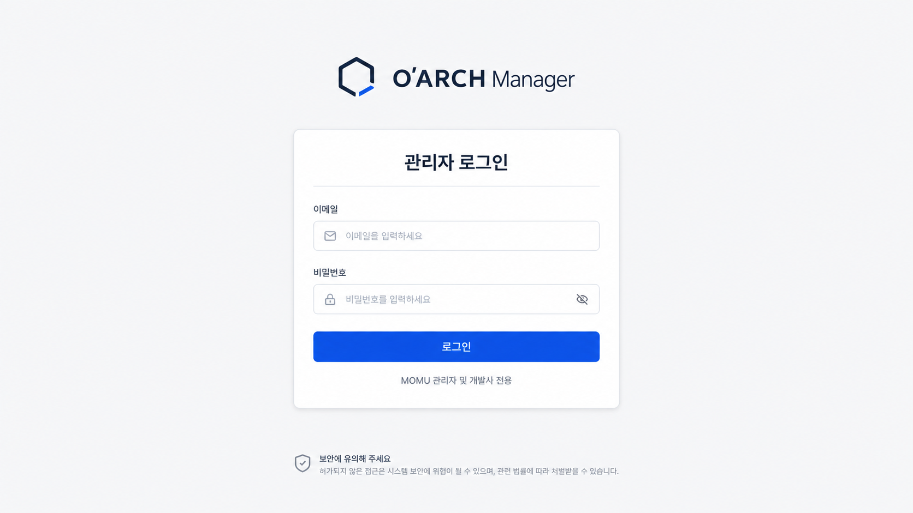
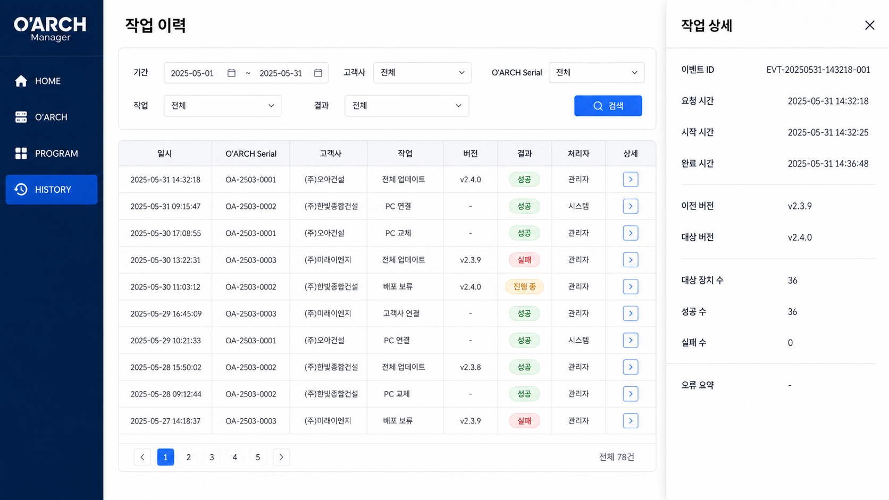

# OARCH Manager 1차 관리자 웹 개발 인계서

문서 버전: 1.0  
작성 기준일: 2026-09-16  
백엔드 기준 저장소: `SwithGit/momu_backend`  
백엔드 기준 커밋: `e17259a5e1199935b7ae595a6eeceec933e0e58e` (`QR 수정`, 2026-09-02)  
운영 API 기준 주소: `https://api.mo-cms.com`

## 1 Codex 실행 지침

이 문서를 받은 Codex는 먼저 대상 프론트엔드 저장소의 `AGENTS.md`, 패키지 구성, 라우터, 인증 처리, API 클라이언트, 공통 레이아웃, 폼·테이블·모달·알림 컴포넌트, 환경 변수 규칙을 확인한다. 그 다음 기존 고객용 화면과 인증 흐름을 건드리지 않는 별도 `OARCH 관리자` 영역으로 1차 기능을 구현한다.

구현 범위는 다음 두 화면과 한 개의 등록 기능으로 제한한다.

1. 관리자 로그인
2. 작업 이력
3. 작업 이력 화면에서 여는 OARCH Serial 등록 모달 또는 드로어

개별 업데이트, 라이선스 발급, 프로그램 패키지, 대시보드, 장비 상세, 원격 제어 기능은 이번 범위가 아니다. 목업의 작업 이력 화면에 업데이트 관련 예시가 있더라도 레이아웃 참고용으로만 사용하고 실제 기능으로 만들지 않는다.

백엔드에 아직 없는 API를 프론트에서 임의로 성공 처리하지 않는다. 백엔드 저장소에도 접근할 수 있으면 이 문서의 신규 API 계약에 맞춰 구현한다. 프론트엔드 저장소만 접근할 수 있으면 API 계층과 타입, 화면 상태까지 구현하되 미구현 API 목록을 결과에 명시한다. 개발용 목 데이터가 필요하면 명시적인 개발 환경 플래그 뒤에 두고 운영 빌드에서는 기본적으로 꺼 둔다.

완료 후 대상 저장소에서 사용하는 표준 검사 명령으로 타입 검사, 린트, 테스트, 빌드를 실행한다. 사용자가 요청하지 않았다면 커밋하거나 푸시하지 않는다.

## 2 프로젝트 용어와 역할

| 용어 | 의미 | 이번 시스템에서의 권한 |
|---|---|---|
| 담당자 | OARCH 서비스를 구매한 고객사 사용자 | 기존 고객용 웹과 Unity 클라이언트 사용 |
| 관리자 | MOMU 직원 및 대표 | 신규 관리자 웹에서 고객사와 Serial 연결, 등록 이력 확인 |
| 개발사 | 전체 서비스를 개발·운영하는 개발 주체 | 백엔드와 배포 환경 유지보수 |

현재 백엔드의 `momu_users`와 `/api/momu/auth/login`은 담당자용이다. 이름에 `Admin`이 들어간 기존 미들웨어도 MOMU 직원 계정의 권한을 뜻하지 않는다. 따라서 신규 관리자 웹에서 기존 담당자 로그인을 재사용하면 안 된다.

## 3 1차 제공 범위

### 3.1 포함 범위

- MOMU 관리자 전용 로그인
- 로그인 상태 확인과 로그아웃
- 고객사 검색
- OARCH Serial 신규 등록
- Serial과 고객사, 설치 현장 연결
- 등록 성공·실패 이력 조회
- 기간, 고객사·Serial 통합 검색, 결과 필터, 페이지 이동
- 이력 상세 확인
- 운영 API 연결과 오류 처리
- Swagger 문서와 최소 백엔드 테스트

### 3.2 제외 범위

- 대시보드
- OARCH 전체 목록 전용 화면
- OARCH 상세 화면
- 프로그램 및 패키지 관리
- 개별 또는 전체 업데이트 실행
- 라이선스 발급·연장·과금
- PC 연결, 교체, 원격 제어
- 관리자 계정 생성 UI와 권한 관리 UI
- 통계, CSV 다운로드, 알림 센터

첫 관리자 계정은 백엔드 마이그레이션 또는 운영 스크립트로 생성한다. 비밀번호 원문은 DB에 저장하지 않는다.

## 4 화면 구성

### 4.1 관리자 로그인

권장 경로는 `/oarch-admin/login`이다.

입력 항목은 관리자 이메일과 비밀번호다. 로그인 버튼은 필수값이 있을 때만 활성화하고 요청 중에는 중복 제출을 막는다. 인증 실패 메시지는 계정 존재 여부를 노출하지 않는 일반 문구를 사용한다. 성공하면 `/oarch-admin/history`로 이동한다.

페이지 새로 고침 때 저장된 관리자 토큰이 있으면 관리자 정보 조회 API로 유효성을 확인한다. 토큰이 만료되거나 거부되면 토큰을 제거하고 로그인 화면으로 이동한다.



### 4.2 작업 이력과 Serial 등록

권장 경로는 `/oarch-admin/history`다. 1차에서는 로그인 후 보이는 유일한 업무 화면이다. 화면 상단 오른쪽에 `OARCH Serial 등록` 버튼을 둔다.

목업의 사이드 메뉴와 업데이트 관련 행은 전체 제품의 장기 방향을 보여 주는 예시다. 1차 구현에서는 메뉴를 `작업 이력`과 `로그아웃` 중심으로 단순화하고, 테이블에는 Serial 등록 이력만 표시한다.



#### 검색 영역

- 기간 시작일과 종료일
- 통합 검색어: OARCH Serial, 고객사명, 고객사 ID, 설치 현장명
- 결과: 전체, 성공, 실패
- 검색과 초기화

#### 이력 목록

| 열 | 표시 내용 |
|---|---|
| 일시 | 등록 요청 처리 시각 |
| OARCH Serial | 등록한 Serial |
| 고객사 | 회사명과 고객사 ID |
| 설치 현장 | 등록 시 입력한 현장명 |
| 작업 | `Serial 등록` |
| 결과 | 성공 또는 실패 |
| 처리자 | 로그인한 MOMU 관리자 이름 |
| 상세 | 상세 드로어 또는 모달 열기 |

목록은 서버 페이지네이션을 사용한다. 로딩, 데이터 없음, 오류와 재시도 상태를 각각 보여 준다. 검색 조건이 바뀌면 첫 페이지부터 다시 조회한다.

#### Serial 등록 입력 항목

| 필드 | 필수 | 입력 방식 | 검증과 저장 |
|---|---:|---|---|
| 고객사 | 예 | 서버 검색 후 결과 선택 | 자유 입력 금지. `momu_users.id`를 저장 키로 사용 |
| OARCH Serial | 예 | 직접 입력 | 앞뒤 공백 제거, 영문 대문자·숫자·하이픈만 허용, 최대 64자 제안 |
| 설치 현장명 | 예 | 직접 입력 | 최대 100자 제안. 기존 `momu_devices.deviceName`과 `deviceAlias`의 초기값으로 사용 |
| 관리자 메모 | 아니요 | 여러 줄 입력 | 최대 500자 제안. 감사 이력의 `detail`에 저장 |

Serial의 실제 발급 규칙이 별도로 정해져 있으면 정규식과 최대 길이는 그 규칙으로 교체한다. 고객사는 검색 결과에서 선택해야 하며, 화면에서 회사명만 보내지 않고 고객사 ID를 함께 보낸다.

등록 요청 중에는 닫기와 중복 제출을 제한한다. 성공하면 모달을 닫고 성공 알림을 표시한 뒤 이력 첫 페이지를 다시 조회한다. 중복 Serial은 입력 항목 아래에 명확히 표시한다. 실패하면 입력값을 유지한다.

## 5 현재 Momu 백엔드 확인 결과

### 5.1 현재 사용할 수 있는 기반

| 항목 | 현재 상태 | 근거 파일 |
|---|---|---|
| 운영 API 라우트 | `/api/momu`에 Momu 라우터 연결 | `server.js:82` |
| Swagger | `/api/api-docs` 제공 | `server.js` |
| 담당자 로그인 | `POST /api/momu/auth/login`, `momu_users` 조회 | `routes/momu/auth.js:191` |
| 담당자 인증 | Bearer JWT와 `momu_users` 기반 | `middleware/momuAuth.js:9` |
| 기기 등록 | `POST /api/momu/device/add` | `routes/momu/device.js:38` |
| 기기 조회 | `POST /api/momu/device/list` | `routes/momu/device.js:174` |
| 기존 이력 | 프로그램 설정 변경 이력 조회와 다운로드 | `routes/momu/programHistoryRouter.js:51`, `:199` |
| CORS | 환경 변수 기반 허용 목록 | `server.js:43` |

현재 기기 등록 로직은 `momu_devices`에 고객사 ID, 장비명, Serial, 상태를 저장하고 활성 프로그램과 기본 설정을 연결한다. 이 동작은 Serial 등록 후 기존 담당자 웹과 Unity 클라이언트에서 장비를 조회할 수 있게 하는 기반으로 재사용할 수 있다.

### 5.2 그대로 사용하면 안 되는 항목

| 문제 | 영향 | 필요한 조치 |
|---|---|---|
| MOMU 직원용 계정과 역할이 없음 | 담당자 토큰과 관리자 토큰을 구분할 수 없음 | 별도 관리자 계정 테이블과 JWT 범위 추가 |
| `requireMomuAdmin`이 실제 직원 관리자 권한이 아님 | 이름만 보고 사용하면 담당자가 관리자 API에 접근할 수 있음 | `requireOarchAdmin` 신규 미들웨어 추가 |
| `/device/add`, `/device/list`에 관리자 인증이 없음 | 요청 본문의 고객사 ID를 신뢰하는 보안 문제가 있음 | 관리자 전용 API에서 인증 후 서비스 계층 호출 |
| 고객사 검색 API가 없음 | 등록 화면에서 안전하게 고객사를 선택할 수 없음 | 관리자 전용 고객사 검색 API 추가 |
| Serial 등록 감사 이력이 없음 | 누가 언제 무엇을 등록했는지 표시할 수 없음 | 전용 감사 테이블과 조회 API 추가 |
| 기존 program-history는 설정 변경 이력임 | 관리자 등록 이력 화면 요구와 데이터가 다름 | 신규 관리자 이력 API 사용 |
| 프론트 운영 도메인이 CORS 목록에 없을 수 있음 | 브라우저 요청이 차단됨 | 배포 시 `CORS_ALLOWED_ORIGINS`에 정확한 origin 추가 |

## 6 신규 관리자 API 계약

신규 API는 `/api/momu/oarch-admin` 아래에 둔다. 기존 담당자 API의 요청·응답을 변경하지 않는다.

### 6.1 공통 규칙

- 로그인 외 모든 요청은 `Authorization: Bearer <token>`을 사용한다.
- 관리자 JWT에는 담당자 토큰과 다른 audience 또는 scope인 `oarch:admin`을 넣는다.
- 관리자 API는 담당자 토큰을 거부하고 담당자 API는 관리자 토큰을 권한으로 인정하지 않는다.
- JSON 응답은 최소한 `success`와 `message`를 포함한다.
- 클라이언트가 분기해야 하는 오류에는 안정적인 `code`를 포함한다.
- 시간은 ISO 8601 문자열로 전달한다. DB와 서버의 기준 시간대 정책을 한 가지로 유지한다.

권장 오류 상태는 다음과 같다.

| HTTP | 용도 | 예시 코드 |
|---:|---|---|
| 400 | 입력 형식 오류 | `VALIDATION_ERROR` |
| 401 | 로그인 실패, 토큰 없음·만료 | `UNAUTHORIZED` |
| 403 | 비활성 관리자, 권한 부족 | `FORBIDDEN` |
| 404 | 고객사 없음 | `CUSTOMER_NOT_FOUND` |
| 409 | Serial 중복 | `SERIAL_ALREADY_EXISTS` |
| 500 | 서버 내부 오류 | `INTERNAL_ERROR` |

### 6.2 관리자 로그인

`POST /api/momu/oarch-admin/auth/login`

요청:

```json
{
  "email": "admin@example.com",
  "password": "entered-password"
}
```

성공 응답:

```json
{
  "success": true,
  "message": "로그인되었습니다.",
  "accessToken": "<jwt>",
  "admin": {
    "adminSeq": 1,
    "email": "admin@example.com",
    "name": "관리자",
    "role": "ADMIN"
  }
}
```

로그인 API에는 IP와 계정 기준 요청 제한을 적용한다. 실패 응답은 이메일 존재 여부를 구분하지 않는다.

### 6.3 관리자 정보 확인

`GET /api/momu/oarch-admin/auth/me`

성공 응답:

```json
{
  "success": true,
  "admin": {
    "adminSeq": 1,
    "email": "admin@example.com",
    "name": "관리자",
    "role": "ADMIN"
  }
}
```

### 6.4 고객사 검색

`GET /api/momu/oarch-admin/customers?search=검색어&page=1&pageSize=20`

검색 대상은 고객사 ID, 회사명, 담당자명, 담당자 이메일이다. 비밀번호 관련 열과 내부 인증 정보는 절대 반환하지 않는다.

성공 응답:

```json
{
  "success": true,
  "items": [
    {
      "id": "customer01",
      "companyName": "고객사명",
      "companyAddress": "주소",
      "managerName": "담당자",
      "managerEmail": "manager@example.com"
    }
  ],
  "pagination": {
    "page": 1,
    "pageSize": 20,
    "total": 1,
    "totalPages": 1
  }
}
```

### 6.5 OARCH Serial 등록

`POST /api/momu/oarch-admin/serials`

요청:

```json
{
  "customerId": "customer01",
  "serialNumber": "OA-2609-0001",
  "siteName": "서울 본사 로비",
  "memo": "1차 설치"
}
```

성공 응답:

```json
{
  "success": true,
  "message": "OARCH Serial이 등록되었습니다.",
  "device": {
    "deviceSeq": 12,
    "customerId": "customer01",
    "serialNumber": "OA-2609-0001",
    "siteName": "서울 본사 로비",
    "status": "inactive",
    "createdAt": "2026-09-16T10:00:00+09:00"
  }
}
```

처리 순서는 다음과 같다.

1. 관리자 토큰과 계정 활성 상태를 확인한다.
2. 고객사 존재 여부를 확인한다.
3. Serial을 정규화하고 중복 여부를 확인한다.
4. 트랜잭션을 시작한다.
5. `momu_devices`에 고객사 ID, 현장명, Serial을 저장한다.
6. 기존 `/device/add`의 활성 프로그램 연결과 기본 설정 생성 로직을 공통 서비스로 추출해 실행한다.
7. 성공 감사 이력을 저장하고 커밋한다.
8. 중간 단계가 실패하면 전체 등록을 롤백한다. 실패 이력은 롤백된 트랜잭션 밖에서 민감정보 없이 별도로 남긴다.

관리자 라우터에서 기존 `/device/add` HTTP 엔드포인트를 다시 호출하지 않는다. DB 작업을 담당하는 공통 서비스 함수를 만들어 담당자 흐름과 관리자 흐름이 함께 사용하게 한다.

### 6.6 등록 이력 조회

`GET /api/momu/oarch-admin/history?search=&dateFrom=&dateTo=&result=&page=1&pageSize=20`

성공 응답:

```json
{
  "success": true,
  "items": [
    {
      "auditSeq": 101,
      "createdAt": "2026-09-16T10:00:00+09:00",
      "actionType": "SERIAL_REGISTER",
      "result": "SUCCESS",
      "adminName": "관리자",
      "serialNumber": "OA-2609-0001",
      "customerId": "customer01",
      "companyName": "고객사명",
      "siteName": "서울 본사 로비",
      "message": "등록 완료"
    }
  ],
  "pagination": {
    "page": 1,
    "pageSize": 20,
    "total": 1,
    "totalPages": 1
  }
}
```

별도 상세 API는 1차에 필수적이지 않다. 목록 항목이 상세 드로어에 필요한 값을 모두 포함하게 한다. 이후 감사 정보가 커지면 `GET /history/:auditSeq`를 추가한다.

## 7 권장 DB 변경

운영 DB는 `oarch_db`를 사용한다. 마이그레이션은 실행 전 대상 DB를 검증하고 dry-run과 apply 모드를 제공한다.

### 7.1 관리자 계정 테이블

권장 테이블명은 `momu_admin_users`다.

| 열 | 권장 형식 | 설명 |
|---|---|---|
| adminSeq | BIGINT UNSIGNED PK AI | 관리자 키 |
| email | VARCHAR(254) UNIQUE | 로그인 이메일, 소문자 정규화 |
| password_hash | VARCHAR(255) | bcrypt 해시 |
| name | VARCHAR(100) | 화면 표시 이름 |
| role | VARCHAR(30) | 1차는 `ADMIN`, 향후 `SUPER_ADMIN`, `VIEWER` 확장 가능 |
| isActive | TINYINT(1) | 로그인 허용 여부 |
| auth_version | INT UNSIGNED | 토큰 일괄 무효화용 |
| lastLoginAt | DATETIME NULL | 최근 로그인 |
| createdAt | TIMESTAMP | 생성 시각 |
| updatedAt | TIMESTAMP | 수정 시각 |

### 7.2 관리자 감사 이력 테이블

권장 테이블명은 `momu_oarch_admin_audits`다.

| 열 | 권장 형식 | 설명 |
|---|---|---|
| auditSeq | BIGINT UNSIGNED PK AI | 이력 키 |
| adminSeq | BIGINT UNSIGNED NULL | 처리 관리자 |
| actionType | VARCHAR(40) | `SERIAL_REGISTER` |
| result | VARCHAR(20) | `SUCCESS`, `FAILURE` |
| targetDeviceSeq | BIGINT UNSIGNED NULL | 생성된 장비 키 |
| customerId | VARCHAR(191) NULL | 대상 고객사 ID |
| serialNumber | VARCHAR(64) NULL | 정규화된 Serial |
| siteName | VARCHAR(100) NULL | 설치 현장명 |
| message | VARCHAR(255) NULL | 표시 가능한 결과 요약 |
| detail | JSON NULL | 관리자 메모와 안전한 부가 정보 |
| createdAt | TIMESTAMP | 처리 시각 |

감사 이력에는 비밀번호, JWT, SMTP 자격 증명, AWS 키, 전체 요청 헤더를 저장하지 않는다.

### 7.3 기존 기기 테이블 보완

`momu_devices`를 Serial과 고객사를 연결하는 기준 테이블로 계속 사용한다. 1차에서는 별도 `oarch_units` 테이블을 만들 필요가 없다. 현재 담당자 웹과 Unity 클라이언트가 이 테이블을 사용하므로 등록 즉시 기존 서비스에서 같은 장비를 볼 수 있다.

운영 DB에서 빈 Serial과 중복 Serial을 먼저 조회한 뒤 문제가 없을 때 `serialNumber` 고유 인덱스를 추가한다. 기존 데이터가 정리되기 전에는 마이그레이션이 자동으로 값을 삭제하거나 합치면 안 된다.

## 8 프론트엔드 구현 구조

대상 저장소의 구조를 우선한다. 다음은 기능 경계를 보여 주는 예시이며 폴더명을 그대로 강제하지 않는다.

```text
oarch-admin/
  api/
    adminAuthApi
    adminCustomersApi
    adminSerialApi
    adminHistoryApi
  components/
    AdminRouteGuard
    AdminLayout
    SerialRegistrationDialog
    AdminHistoryFilters
    AdminHistoryTable
    AdminHistoryDetail
  pages/
    AdminLoginPage
    AdminHistoryPage
  model/
    types
    validators
  session/
    adminSession
```

관리자 토큰은 기존 담당자 토큰과 다른 저장 키를 사용한다. 예를 들어 `oarchAdminAccessToken`을 사용한다. 대상 프로젝트에 이미 안전한 인증 저장 규칙이 있으면 그 규칙을 따른다. 별도 기준이 없다면 1차에서는 `sessionStorage`를 우선하고, 페이지 새로 고침 때 `/auth/me`로 토큰을 검증한다.

API 주소는 코드에 직접 박지 않고 대상 프로젝트의 환경 변수 규칙을 사용한다. 운영 값은 `https://api.mo-cms.com`이다. 변수명은 Vite, Next.js 등 현재 빌드 도구에 맞춘다.

### 8.1 권장 프론트 타입

```ts
type AdminRole = 'ADMIN' | 'SUPER_ADMIN' | 'VIEWER';
type AuditResult = 'SUCCESS' | 'FAILURE';

interface AdminLoginRequest {
  email: string;
  password: string;
}

interface AdminProfile {
  adminSeq: number;
  email: string;
  name: string;
  role: AdminRole;
}

interface CustomerOption {
  id: string;
  companyName: string;
  companyAddress?: string;
  managerName?: string;
  managerEmail?: string;
}

interface SerialCreateRequest {
  customerId: string;
  serialNumber: string;
  siteName: string;
  memo?: string;
}

interface AdminAuditItem {
  auditSeq: number;
  createdAt: string;
  actionType: 'SERIAL_REGISTER';
  result: AuditResult;
  adminName: string;
  serialNumber: string;
  customerId: string;
  companyName: string;
  siteName: string;
  message?: string;
}
```

### 8.2 기존 프론트와의 충돌 방지

- 기존 담당자 로그인 URL, 토큰 키, 사용자 상태 저장소를 변경하지 않는다.
- 관리자 라우트는 `/oarch-admin/*`처럼 독립된 경로 접두사를 사용한다.
- 관리자 API 클라이언트에만 관리자 토큰을 붙인다.
- 공통 HTTP 인터셉터를 수정할 때 담당자 요청에 관리자 토큰이 들어가지 않는지 확인한다.
- 기존 공통 컴포넌트는 재사용하되 관리자 전용 상태와 비즈니스 로직을 공통 전역 상태에 섞지 않는다.
- 401 응답은 해당 관리자 세션만 지우고 관리자 로그인으로 이동한다.

## 9 백엔드 구현 구조

권장 파일 구분은 다음과 같다. 실제 이름은 현재 CommonJS와 Express 구조에 맞춘다.

```text
routes/momu/oarchAdmin/
  index.js
  auth.js
  customers.js
  serials.js
  history.js
middleware/
  oarchAdminAuth.js
services/
  oarchAdminToken.js
  momuDeviceRegistration.js
scripts/
  migrate-oarch-admin.cjs
```

`routes/momu/index.js`에는 `/oarch-admin` 라우터만 추가한다. 기존 `/auth`, `/device`, `/program`, `/program-history`의 요청 형식과 응답 형식을 바꾸지 않는다.

기존 `/device/add`에 들어 있는 장비 생성, 활성 프로그램 연결, 기본 설정 생성 로직은 `momuDeviceRegistration` 같은 서비스로 추출한다. 기존 라우트와 신규 관리자 Serial 라우트가 이 서비스를 함께 호출하도록 만들고 회귀 테스트를 추가한다.

## 10 상태와 오류 처리

| 상황 | 화면 동작 |
|---|---|
| 로그인 입력 누락 | 요청하지 않고 해당 필드 안내 |
| 로그인 401 | `이메일 또는 비밀번호를 확인해 주세요.` |
| 관리자 토큰 만료 | 관리자 세션 제거 후 로그인 이동 |
| 고객사 검색 중 | 선택 목록에 로딩 표시 |
| 고객사 검색 결과 없음 | `일치하는 고객사가 없습니다.` |
| Serial 409 | Serial 입력 아래 `이미 등록된 Serial입니다.` |
| 등록 400 | 서버 필드 오류를 해당 입력에 연결 |
| 등록 500 또는 네트워크 오류 | 입력 유지, 재시도 가능한 알림 표시 |
| 이력 없음 | 조건에 맞는 이력이 없다는 빈 상태 표시 |
| 이력 조회 실패 | 오류 안내와 재시도 버튼 표시 |

프론트 로그와 분석 도구에 토큰, 비밀번호, 전체 관리자 이메일을 남기지 않는다. 서버 오류 원문이나 SQL 오류를 사용자에게 그대로 보여 주지 않는다.

## 11 구현 순서

1. 대상 프론트 저장소의 구조와 기존 고객 흐름을 조사한다.
2. 백엔드에 관리자 계정과 감사 이력 마이그레이션을 추가한다.
3. 관리자 JWT, 인증 미들웨어, 로그인과 정보 확인 API를 구현한다.
4. 기존 장비 등록 로직을 공통 서비스로 추출하고 회귀 테스트한다.
5. 고객사 검색, Serial 등록, 관리자 이력 API를 구현한다.
6. Swagger에 신규 API와 오류 응답을 기록한다.
7. 프론트에 관리자 세션, 라우트 보호, 로그인 화면을 구현한다.
8. 작업 이력 화면과 검색·페이지 이동·상세 표시를 구현한다.
9. Serial 등록 모달과 고객사 검색을 연결한다.
10. 운영 프론트 origin을 백엔드 CORS 허용 목록에 추가한다.
11. 개발·스테이징 환경에서 통합 테스트한 뒤 운영에 배포한다.

백엔드 API가 준비되기 전에 프론트를 먼저 만드는 경우 7~9단계를 타입과 어댑터 중심으로 진행할 수 있다. 다만 운영 빌드에서 목 응답을 사용하면 안 된다.

## 12 검증 시나리오

### 12.1 인증

- 관리자 이메일과 올바른 비밀번호로 로그인할 수 있다.
- 잘못된 비밀번호는 계정 존재 여부를 노출하지 않고 거부된다.
- 비활성 관리자 계정은 로그인할 수 없다.
- 담당자용 토큰으로 관리자 API를 호출하면 401 또는 403이 반환된다.
- 관리자용 토큰이 기존 담당자 세션으로 저장되지 않는다.
- `/oarch-admin/history` 직접 접근 시 미인증 사용자는 로그인으로 이동한다.
- 새로 고침 후 유효한 세션은 유지되고 만료 세션은 제거된다.

### 12.2 Serial 등록

- 고객사 검색 결과에서 담당자를 선택할 수 있다.
- 존재하지 않는 고객사 ID는 서버에서 거부된다.
- Serial 앞뒤 공백과 소문자 처리 규칙이 서버와 프론트에서 일치한다.
- 중복 Serial은 409로 거부되고 중복 장비나 기본 설정이 생기지 않는다.
- 성공 시 `momu_devices.id`가 선택한 고객사 ID와 일치한다.
- 성공 시 기존 로직과 같은 프로그램 연결과 기본 설정이 생성된다.
- 중간 실패 시 장비만 남거나 설정만 남는 부분 저장이 없다.
- 성공 이력이 즉시 목록 첫 페이지에 보인다.

### 12.3 이력과 운영 환경

- 기간과 검색어, 결과 필터가 함께 적용된다.
- 페이지를 이동해도 현재 검색 조건이 유지된다.
- 상세 화면에서 Serial, 고객사, 현장, 처리자, 결과를 확인할 수 있다.
- 프론트 운영 도메인에서 CORS 오류 없이 API를 호출한다.
- Swagger에서 신규 관리자 API를 확인하고 직접 테스트할 수 있다.
- 프론트 타입 검사, 린트, 테스트, 빌드가 통과한다.
- 백엔드 테스트와 시작 점검이 통과한다.

## 13 완료 기준

다음 조건을 모두 만족하면 1차 개발 완료로 본다.

- 관리자 로그인과 작업 이력 두 화면이 대상 프론트의 기존 디자인 체계 안에서 동작한다.
- 작업 이력 화면에서 고객사를 선택하고 OARCH Serial을 등록할 수 있다.
- 등록 결과가 `momu_devices`와 관리자 감사 이력에 함께 반영된다.
- 기존 담당자 웹과 Unity 클라이언트가 등록된 장비를 기존 방식으로 조회할 수 있다.
- 관리자 인증과 담당자 인증이 분리되어 서로의 토큰으로 접근할 수 없다.
- 중복 등록과 부분 저장을 서버가 막는다.
- 업데이트, 라이선스, 프로그램 관리 기능은 노출되지 않는다.
- 기존 담당자용 프론트와 백엔드 API의 회귀가 없다.
- 배포 환경의 API 주소와 CORS가 설정되어 있다.
- Swagger와 테스트가 실제 구현을 반영한다.

## 14 구현 결과 보고 형식

작업을 마친 Codex는 다음 내용을 사용자에게 보고한다.

1. 추가·변경한 파일
2. 구현한 화면과 사용자 흐름
3. 실제 연결한 API와 아직 미구현인 API
4. DB 마이그레이션 파일과 실행 방법
5. 환경 변수 또는 CORS에 필요한 운영 설정
6. 실행한 검사 명령과 결과
7. 남은 위험 또는 사용자 확인이 필요한 항목

비밀번호, JWT, AWS 키, SMTP 자격 증명, DB 비밀번호는 문서와 결과 보고에 포함하지 않는다.
